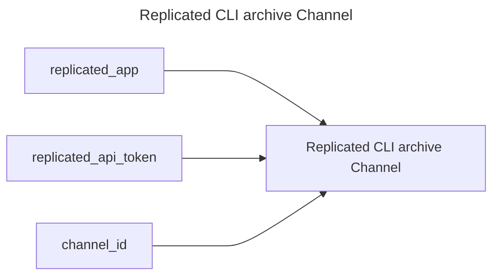

# Archive a channel

```mermaid
---
title: Replicated CLI archive Channel
---
graph LR
replicated_cli_archive_channel["Replicated CLI archive Channel"]
replicated_app ---> replicated_cli_archive_channel
replicated_api_token ---> replicated_cli_archive_channel
channel_id ---> replicated_cli_archive_channel
```