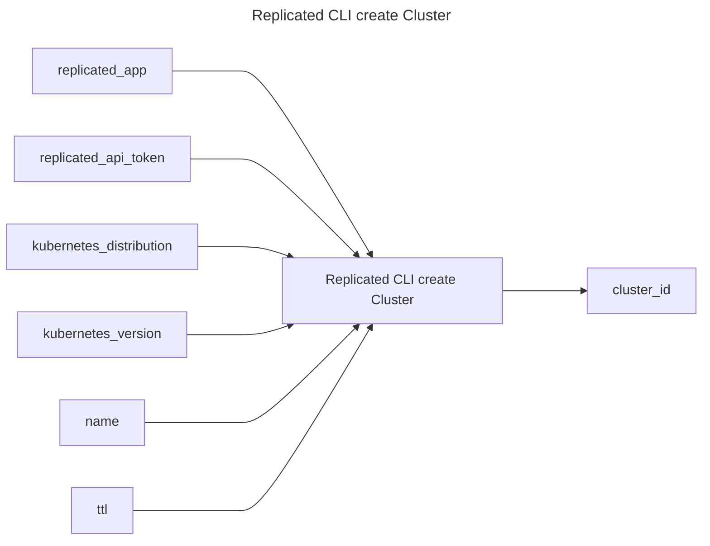

# CLI: Create Cluster

```mermaid
---
title: Replicated CLI create Cluster
---
graph LR
replicated_cli_create_cluster["Replicated CLI create Cluster"]
replicated_app ---> replicated_cli_create_cluster
replicated_api_token ---> replicated_cli_create_cluster
kubernetes_distribution ---> replicated_cli_create_cluster
kubernetes_version ---> replicated_cli_create_cluster
name ---> replicated_cli_create_cluster
ttl ---> replicated_cli_create_cluster
replicated_cli_create_cluster ---> cluster_id
```