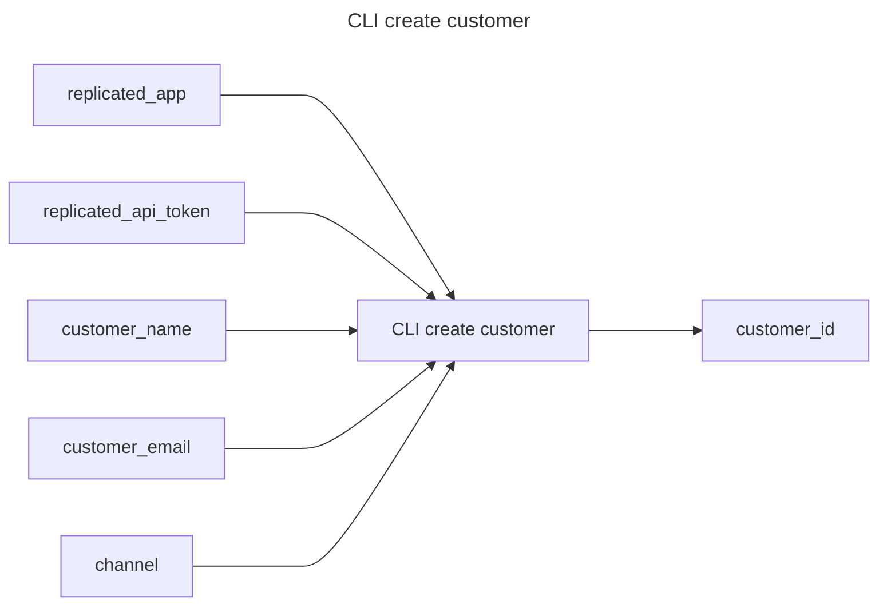

# CLI: Create Customer

```mermaid
---
title: CLI create customer
---
graph LR
cli_create_customer["CLI create customer"]
replicated_app ---> cli_create_customer
replicated_api_token ---> cli_create_customer
customer_name ---> cli_create_customer
customer_email ---> cli_create_customer
channel ---> cli_create_customer
cli_create_customer ---> customer_id
```