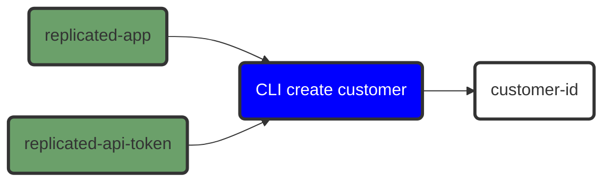

# CLI: Create Customer

```mermaid
flowchart LR
input1(replicated-app):::required-->action(CLI create customer):::action
input2(replicated-api-token):::required-->action(CLI create customer):::action
action(CLI create customer)-->output1(customer-id):::output
classDef required fill:#6ba06a,stroke:#333,stroke-width:3px
classDef optional fill:#d9b430,stroke:#333,stroke-width:3px
classDef action fill:blue,stroke:#333,stroke-width:3px,color:#ffffff
classDef output fill:#fff,stroke:#333,stroke-width:3px,color:#333
```