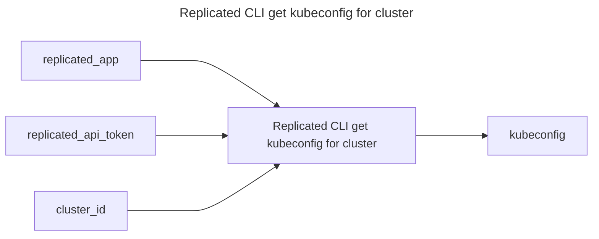

# CLI: Get kubeconfig for Cluster

```mermaid
---
title: Replicated CLI get kubeconfig for cluster
---
graph LR
replicated_cli_get_kubeconfig_for_cluster["Replicated CLI get kubeconfig for cluster"]
replicated_app ---> replicated_cli_get_kubeconfig_for_cluster
replicated_api_token ---> replicated_cli_get_kubeconfig_for_cluster
cluster_id ---> replicated_cli_get_kubeconfig_for_cluster
replicated_cli_get_kubeconfig_for_cluster ---> kubeconfig
```