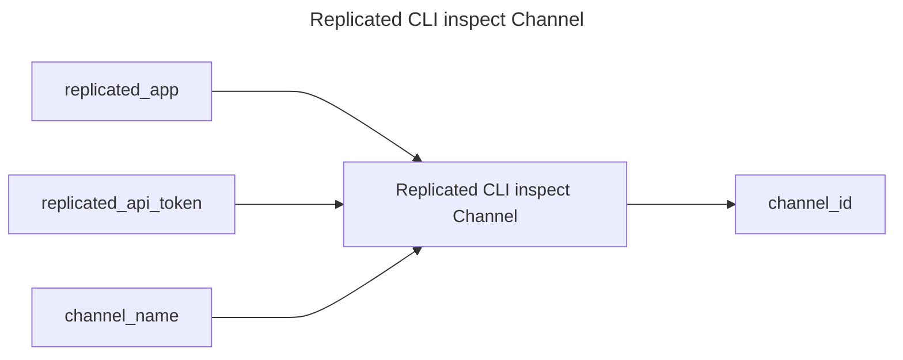

# Inspect a channel

```mermaid
---
title: Replicated CLI inspect Channel
---
graph LR
replicated_cli_inspect_channel["Replicated CLI inspect Channel"]
replicated_app ---> replicated_cli_inspect_channel
replicated_api_token ---> replicated_cli_inspect_channel
channel_name ---> replicated_cli_inspect_channel
replicated_cli_inspect_channel ---> channel_id
```