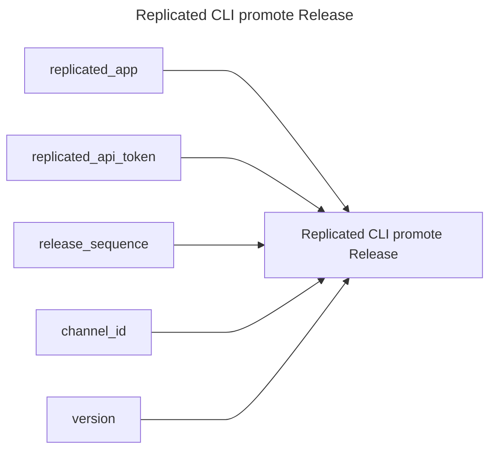

# Promote a release

```mermaid
---
title: Replicated CLI promote Release
---
graph LR
replicated_cli_promote_release["Replicated CLI promote Release"]
replicated_app ---> replicated_cli_promote_release
replicated_api_token ---> replicated_cli_promote_release
release_sequence ---> replicated_cli_promote_release
channel_id ---> replicated_cli_promote_release
version ---> replicated_cli_promote_release
```