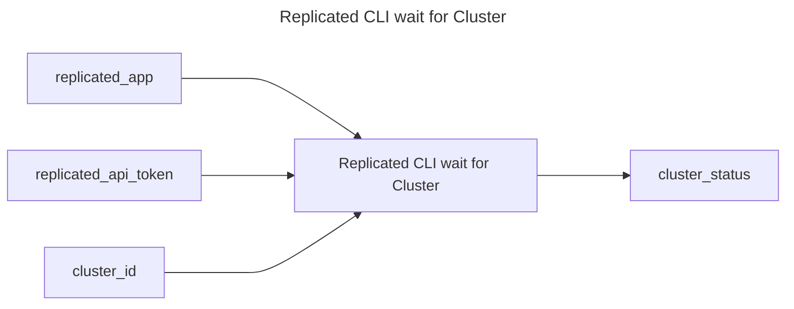

# CLI: Wait for cluster to be running

```mermaid
---
title: Replicated CLI wait for Cluster
---
graph LR
replicated_cli_wait_for_cluster["Replicated CLI wait for Cluster"]
replicated_app ---> replicated_cli_wait_for_cluster
replicated_api_token ---> replicated_cli_wait_for_cluster
cluster_id ---> replicated_cli_wait_for_cluster
replicated_cli_wait_for_cluster ---> cluster_status

```